# 🚀 Crypto Analytics Suite

## 📖 Project Description
A dynamic **Streamlit dashboard** that fetches live cryptocurrency data from the CoinGecko API, cleans it, and visualizes key metrics in an interactive, mobile‑friendly web app.  

🔗 **Live Demo:** [bs-crypto-analysis.streamlit.app](https://bs-crypto-analysis.streamlit.app)

---
## 📓 Jupyter Notebook Workflow

### Data Fetching
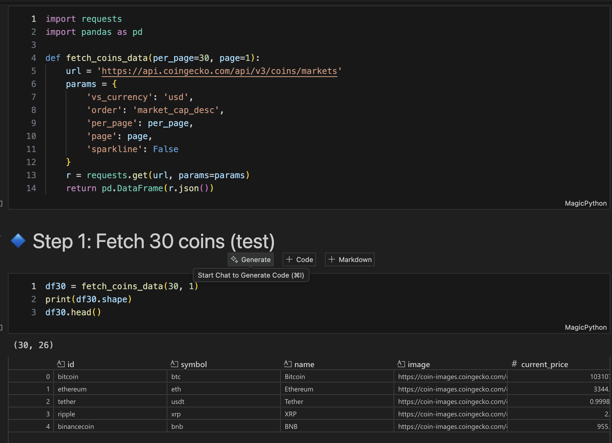 

### Data Cleaning
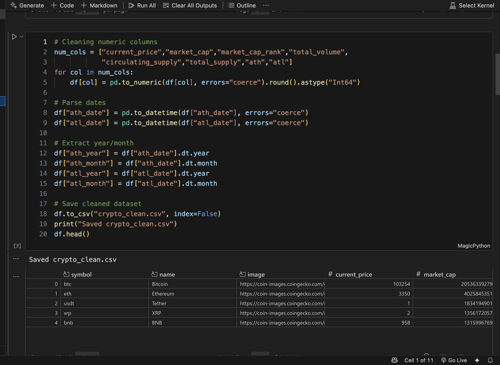

### Exploratory Data Analysis
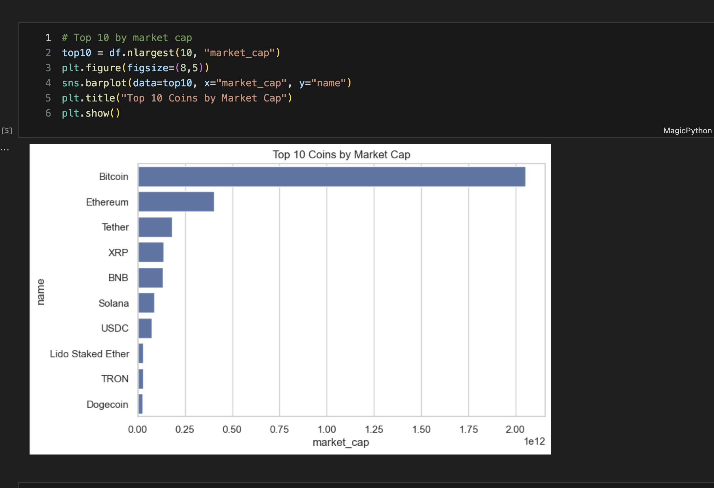
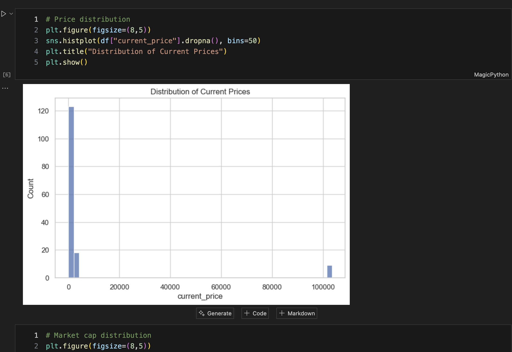
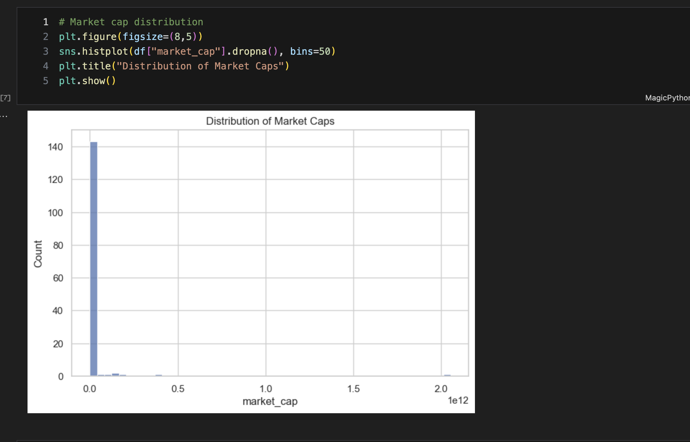


## 📸 Dashboard Preview

### Overview
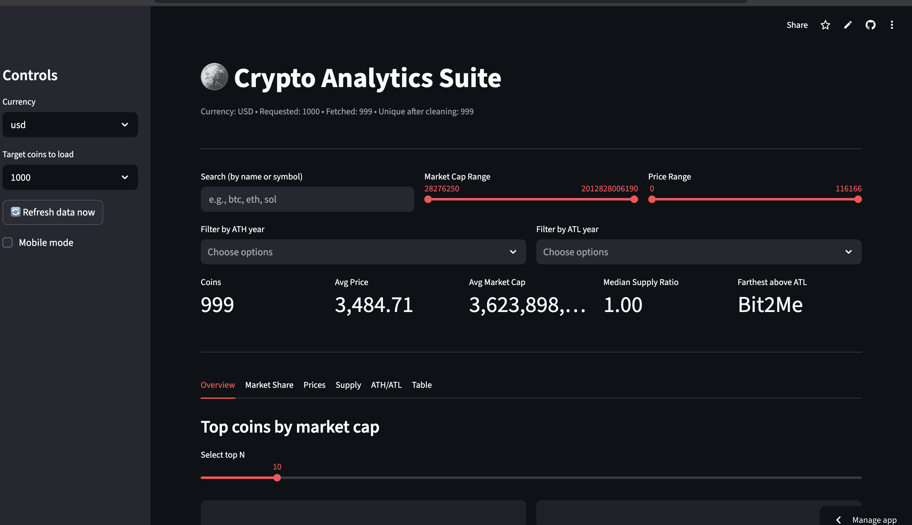
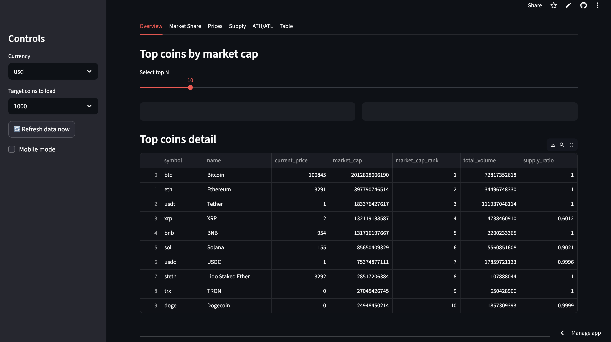

### Market Share
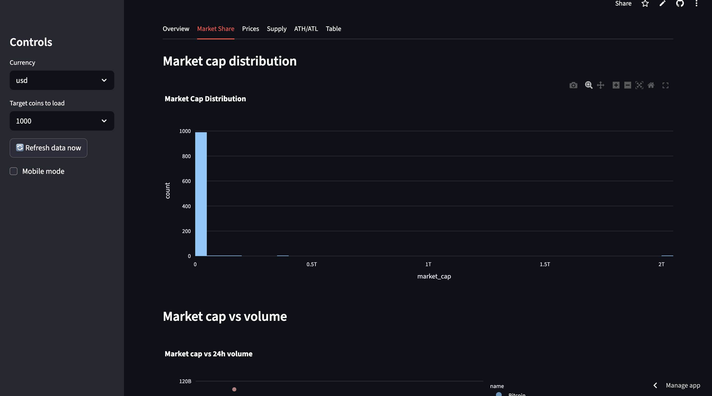

### Prices
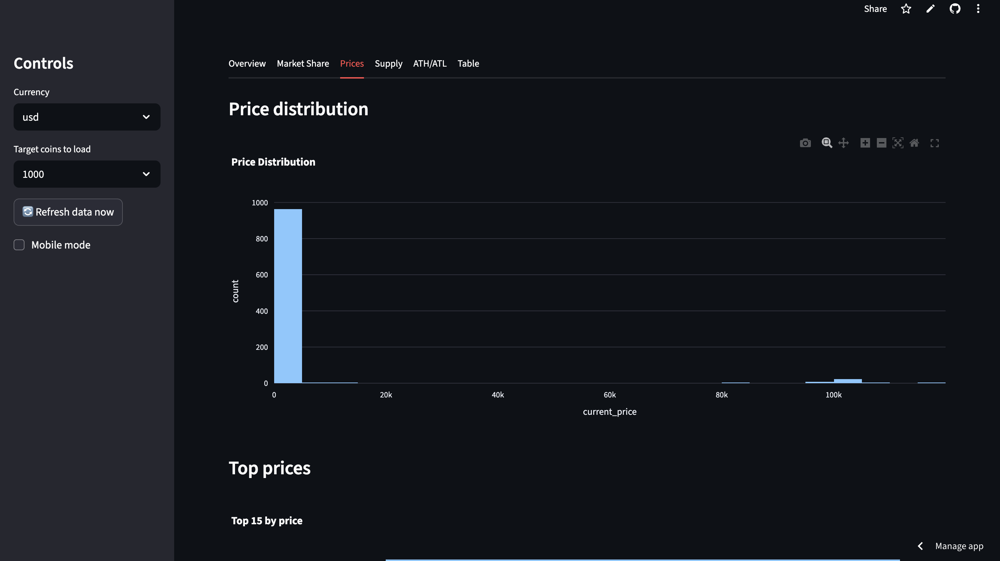

### Supply Analysis
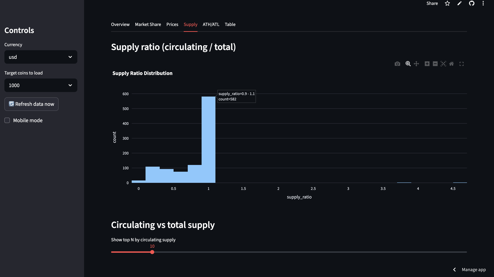

### ATH/ATL Trends
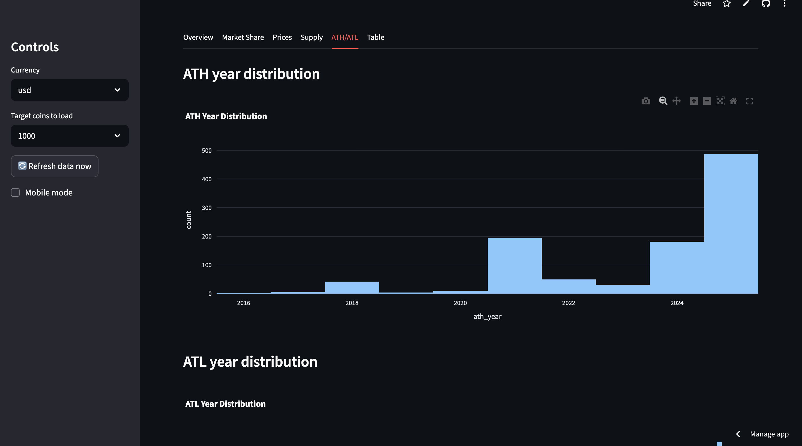

### Full Dataset Table
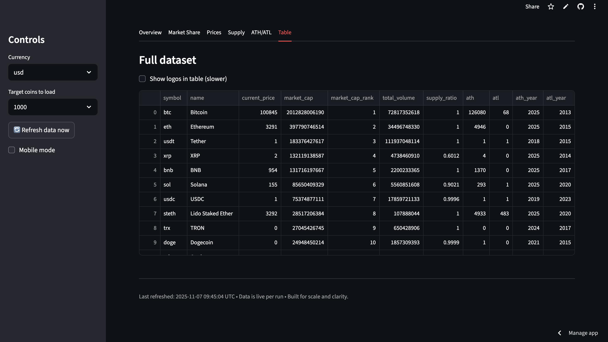

*(Replace these with actual screenshots saved in an `assets/` folder.)*

---

## ✨ Features
- **Live data fetch**: Choose to load 500, 1000, 5000, or 10000 coins dynamically.  
- **Data cleaning pipeline**: Converts numeric fields, parses dates, enriches with supply ratios.  
- **Interactive dashboard**: Market cap, price, supply, ATH/ATL analysis.  
- **Sidebar filters**: Market cap, price, ATH/ATL years, search.  
- **KPI cards**: Live metrics at a glance.  
- **Tabs**: Overview, Market Share, Prices, Supply, ATH/ATL, full dataset table.  
- **Responsive design**: Mobile‑friendly layout with simplified KPI mode.  
- **One‑file app**: `app.py` handles fetching, cleaning, and dashboarding.  

---

## ⚙️ Setup Instructions

### Step‑by‑Step
```bash
# 1. Clone the repository
git clone https://github.com/bhanu2006-24/crypto-analysis.git
cd crypto-analysis

# 2. Create a virtual environment
python -m venv venv

# 3. Activate the environment
# On macOS/Linux
source venv/bin/activate
# On Windows
venv\Scripts\activate

# 4. Install dependencies
pip install -r requirements.txt

# 5. Run the dashboard
streamlit run app.py
